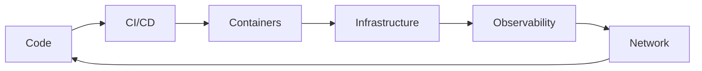

<div align="center">


<br>0

<a href="https://github.com/Bravxo">

</a>
<a href="https://www.linkedin.com/in/bravoagustin/">

</a>

<br><br>


</div>

```txt
┌─[Bravxo@GitHub]
└──╼ $ whoami

DevOps · Network Operations · Automation
```

Busco hacer las tareas repetitivas, mas eficientes.

Me interesa convertir operaciones manuales en sistemas automatizados. mi perfil de github me funciona como un laboratorio personal para documentar herramientas, experimentos y aprendizajes, así como contribuir en proyectos opensource para aprender y aportar en la comunidad.

---

## `01 // focus`

```yaml
devops:
  - Automatización de Redes
  - Integración y despliegue continuo (CI/CD)
  - Contenedores y orquestación

networking:
  - routing & switching
  - Resolución de Incidencias
  - Manejo de VLANs, BGP, MPLS, STP, IPv4/IPv6.

development:
  - Python, C/C++, JS, HTML, CSS, DART, Kotlin.
  - Manejo de frameworks como Flask/FASTAPI, DJango, Flet/Flutter, 
  - MYSQL/MariaDB, OpenSearch, MongoDB y OracleDB.
```

---

## `02 // stack`

<div align="center">


<br><br>


</div>

---

## `03 // operations flow`



---

## `04 // current lab`


| Project              | Description                                    | Stack                  |
| -------------------- | ---------------------------------------------- | ---------------------- |
| `Network Automation` | Automatización de tareas y validaciones de red | Python · ANSIBLE · N8N |
| `monitoreo`          | Laboratorio de métricas, logs y alertas        | Grafana · ChartJS      |
| `workflow-engine`    | Integraciones y procesos automáticos           | n8n · Webhooks         |
| `devops-lab`         | Pruebas de despliegue y contenedores           | Docker · Linux · Nginx |

---

## `05 // currently`

```txt
[+] Automatizando tareas repetitivas en mi trabajo
[+] Aprendiendo sobre infraestructura
[+] Construyendo herramientas internas
[+] Documentando proyectos
[+] Resolviendo incidencias
```

---

<div align="center">

```txt
AUTOMATE  /  OBSERVE  /  DEBUG  /  IMPROVE
```


</div>
